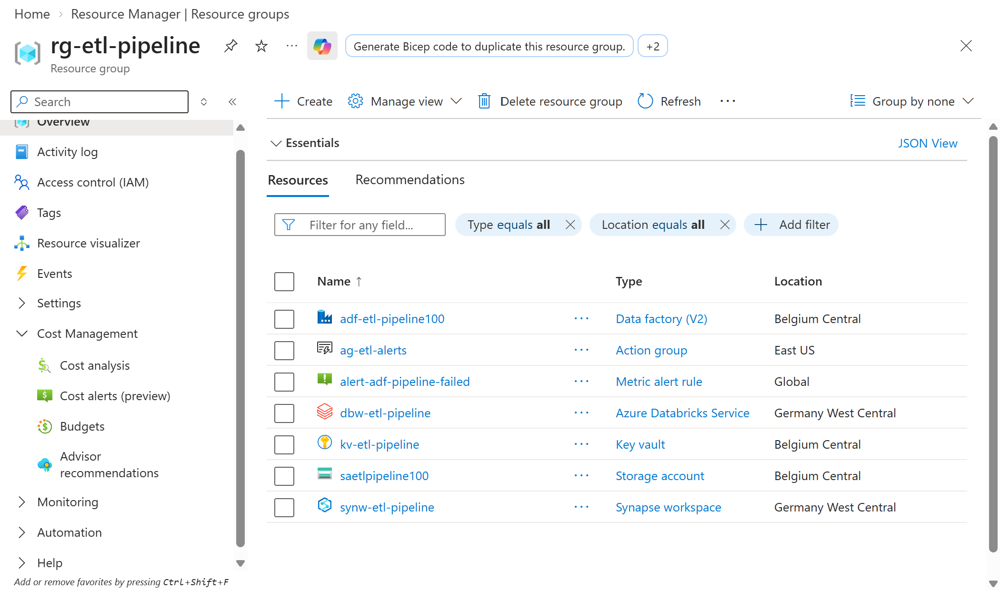
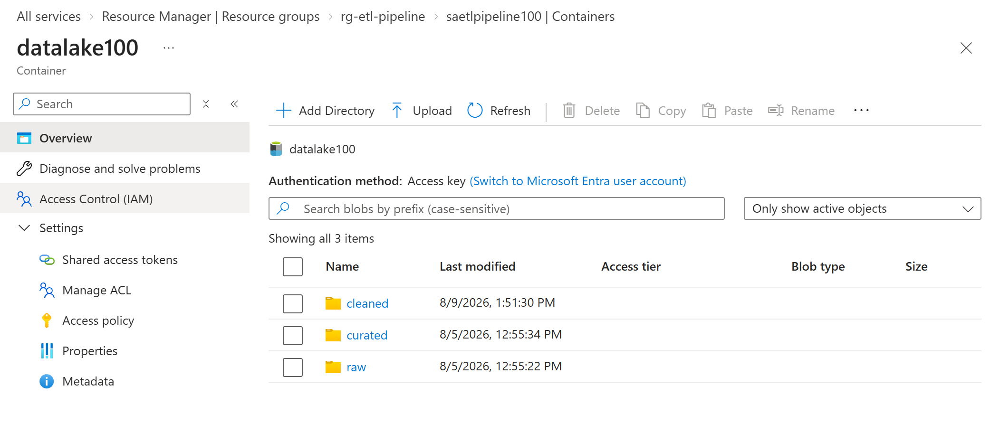
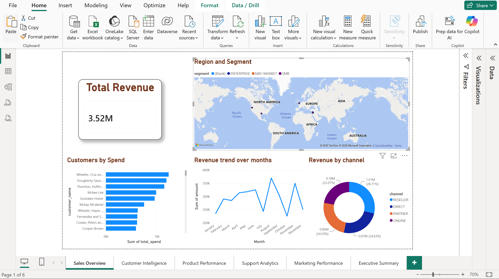
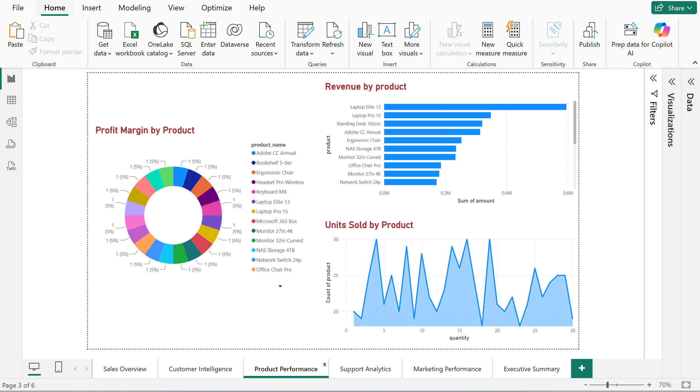
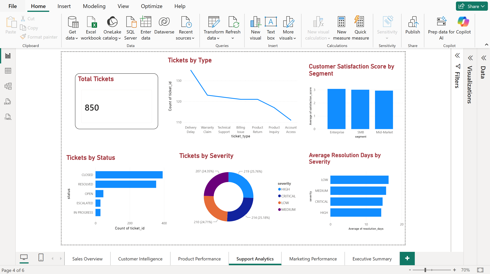
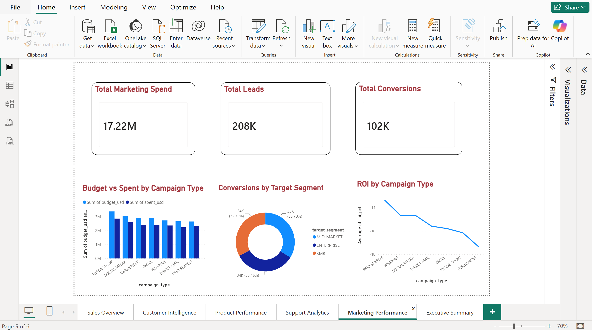
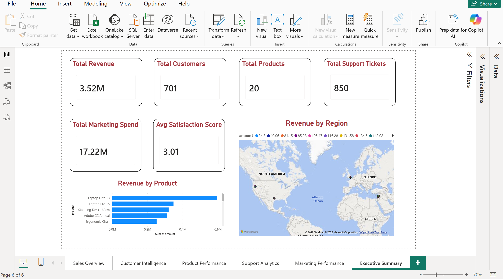

# Azure End-to-End ETL Pipeline


> A fully automated, production-grade ETL pipeline on Microsoft Azure following the **Medallion Architecture** — from raw files to live Power BI dashboards with zero manual intervention.

---
## Screenshots

### Azure Infrastructure

### ADLS Gen2 — Medallion Architecture Zones

### Power BI Dashboards






---

## Architecture
```
CSV / XLSX / JSON  →  Azure Data Factory  →  ADLS Gen2 (raw/)
                                                    ↓
                                            Azure Databricks
                                            nb_clean.py
                                                    ↓
                                          ADLS Gen2 (cleaned/)
                                                    ↓
                                            Azure Databricks
                                            nb_transform.py
                                                    ↓
                                          ADLS Gen2 (curated/)
                                                    ↓
                                     Synapse Serverless SQL views
                                                    ↓
                                       Power BI · 6 dashboards
```
| Layer | Folder | What happens |
|---|---|---|
| Bronze | `raw/` | ADF copies 4 source files here daily |
| Silver | `cleaned/` | nb_clean.py cleans, validates, types |
| Gold | `curated/` | nb_transform.py joins, enriches, segments |

---

## Stack
| Layer | Service |
|---|---|
| Orchestration | Azure Data Factory |
| Storage | ADLS Gen2 + Delta Lake |
| Transformation | Azure Databricks (PySpark) |
| Serving | Azure Synapse Analytics (Serverless) |
| Visualisation | Power BI |
| Security | Azure Key Vault |
| CI/CD | GitHub Actions |
| Monitoring | Azure Monitor |

---
---

## Data Sources — Bronze Layer (`raw/`)
| File | Format | Rows | Columns |
|---|---|---|---|
| `sales_transactions.csv` | CSV | 900 | 18 |
| `master_data.xlsx` | XLSX | 120 | 15–17 |
| `support_tickets.json` | JSON | 850 | 16 |
| `marketing_campaigns.csv` | CSV | 820 | 17 |

---

## CI/CD
Push to `main` → GitHub Actions deploys all 5 notebooks to `/Shared/etl-pipeline/` in Databricks automatically.
| Secret | Description |
|---|---|
| `DATABRICKS_HOST` | Databricks workspace URL |
| `DATABRICKS_TOKEN` | Personal access token |
| `AZURE_CREDENTIALS` | Service principal JSON |

---

## Power BI — 6 Dashboard Pages
Sales Overview · Customer Intelligence · Product Performance · Support Analytics · Marketing Performance · Executive Summary

Scheduled refresh daily at 07:00 UTC via Synapse Serverless SQL.
---

## Quick Setup
1. Provision Azure services — Resource Group, ADLS Gen2, Key Vault, ADF, Databricks, Synapse
2. Grant managed identity permissions on ADLS
3. Upload source files to `raw/` zone
4. Run `pl_ingest_files` in ADF — triggers full pipeline automatically
5. Run `synapse/create_views.sql` in Synapse Studio
6. Connect Power BI to Synapse Serverless endpoint
---

## License
MIT